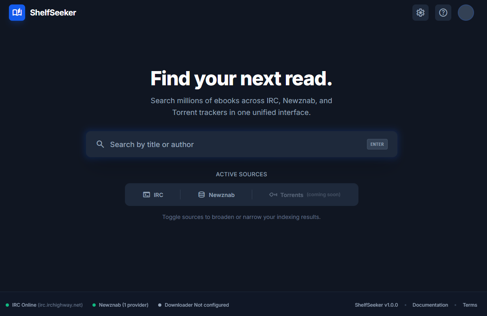

<div align="center">


# ShelfSeeker


Search millions of ebooks across IRC, Newznab, and Torrent trackers in one unified interface.




</div>

---

## ✨ Features

- 🔍 **Multi-Source Search** — IRC (#ebooks), Newznab indexers, and Torrent trackers
- 🌐 **Modern Web UI** — Clean, responsive interface with smooth animations
- 📥 **Direct Downloads** — IRC DCC transfers and NZB support
- ⚙️ **Fully Configurable** — Manage sources and settings through the UI
- 🐳 **Docker Ready** — One-command deployment with Docker Compose

---

## 🚀 Quick Start

### Using Docker (Recommended)

**Option 1: Pull from GitHub Container Registry**
```bash
docker pull ghcr.io/tidusjar/shelfseeker:latest
docker run -d -p 3001:3001 -v ./downloads:/app/server/downloads ghcr.io/tidusjar/shelfseeker:latest
```

**Option 2: Build from source**
```bash
git clone https://github.com/tidusjar/ShelfSeeker.git
cd ShelfSeeker
docker-compose up -d
```

Open **http://localhost:3001** in your browser and start searching!

### Local Development

```bash
# Start API server
cd server && npm install && npm run dev

# Start web frontend (in new terminal)
cd web && npm install && npm run dev
```


See [SETTINGS_GUIDE.md](SETTINGS_GUIDE.md) for all options.

---

## 📚 How It Works

1. **Connect** — Join IRC channels and configure indexers
2. **Search** — Enter a title or author
3. **Browse** — View unified results from all sources
4. **Download** — One-click to save to your library

---

## 🐳 Docker Commands

```bash
docker-compose up -d          # Start
docker-compose logs -f        # View logs
docker-compose down           # Stop
docker-compose restart        # Restart
```

---

## 📖 Documentation

- [Docker Setup Guide](docs/DOCKER.md)
- [Settings & Configuration](SETTINGS_GUIDE.md)
- [Building from Source](BUILD.md)
- [API Documentation](server/README.md)
- [Versioning & Releases](VERSIONING.md)
- [Release Process](RELEASE_PROCESS.md)

---

## 🤝 Contributing

Contributions are welcome! Please read our [Contributing Guide](CONTRIBUTING.md) first.

We use [Conventional Commits](https://www.conventionalcommits.org/) for version management:
```bash
git commit -m "feat: add new feature"      # Minor version bump
git commit -m "fix: resolve bug"           # Patch version bump
git commit -m "feat!: breaking change"     # Major version bump
```

---

## 📄 License

MIT License — see [LICENSE](LICENSE) for details.


