# Automated Release Process

ShelfSeeker uses GitHub Actions to automate the entire release process, from version bumping to Docker image publishing.

## 🎯 Overview

The automated release workflow handles:
- ✅ Version bumping based on conventional commits
- ✅ CHANGELOG.md generation
- ✅ Git tagging
- ✅ Running tests
- ✅ Building Docker images with semantic version tags
- ✅ Publishing to GitHub Container Registry (ghcr.io)
- ✅ Creating GitHub releases

## 🚀 How to Create a Release

### Method 1: Automatic Release on Push (Recommended)

**Just push conventional commits to main - releases happen automatically!**

1. **Make commits using conventional commit format:**
   ```bash
   git commit -m "feat: add new search filters"
   git commit -m "fix: resolve connection timeout"
   git push origin main
   ```

2. **That's it!** The GitHub Actions workflow will:
   - Detect you have releasable commits (feat, fix, perf)
   - Analyze commits to determine version bump
   - Automatically create a release
   - Run tests
   - Build and publish Docker images
   - Create GitHub release with changelog

**No manual triggering needed!** If you push commits like `docs:` or `chore:` that don't affect versioning, no release is created.

### Method 2: Manual Version Bump

If you want to force a specific version bump (override automatic detection):

1. Go to: `Actions` → `Build and Deploy` → `Run workflow`
2. Select the release type:
   - `auto` - Analyze commits and auto-bump (same as automatic)
   - `patch` - Force patch (1.0.0 → 1.0.1)
   - `minor` - Force minor (1.0.0 → 1.1.0)
   - `major` - Force major (1.0.0 → 2.0.0)
3. Click `Run workflow`

### Method 3: Build Without Release

To just build and test without creating a release:

1. Go to: `Actions` → `Build and Deploy` → `Run workflow`
2. Leave release type empty (default)
3. Click `Run workflow`

This will run tests and build Docker images without version bumping.

## 📋 What Happens During a Release

The workflow runs through several jobs in sequence:

### 1. Check Release Job (automatic on push to main)
- Checks if there are any releasable commits since the last tag
- Looks for commits starting with: `feat:`, `fix:`, `perf:`
- If found, signals that a release should be created after tests pass
- If only `docs:`, `chore:`, etc., skips release creation

### 2. Build and Test Job
- Runs tests for web and server components
- Ensures everything builds successfully
- **Must pass before a release is created**

### 3. Create Release Job (runs ONLY if tests pass AND releasable commits found)
- Checks out the code with full git history
- Installs dependencies
- Runs `standard-version` to:
  - Analyze commits since last release
  - Bump version in all package.json files
  - Update CHANGELOG.md with changes
  - Create a git commit and tag
- Pushes changes and tags to GitHub
- **Only runs if build-and-test succeeds**

### 4. Docker Build and Push Job (on main branch or tags only)
- Builds multi-platform Docker images (amd64, arm64, arm/v7)
- Tags images with semantic versions:
  - `1.2.3` (exact version - on releases)
  - `1.2` (major.minor - on releases)
  - `1` (major only - on releases)
  - `latest` (on main branch pushes)
  - `main-abc123` (commit sha - on main branch pushes)
- Pushes to GitHub Container Registry (ghcr.io)

### 5. Create GitHub Release Job (only if a release was created)
- Reads the latest section from CHANGELOG.md
- Creates a GitHub release with:
  - Release tag (e.g., v1.2.3)
  - Release notes from changelog
  - Links to Docker images

## 🏷️ Docker Image Tags

After a release of version `1.2.3`, the following images are available:

```bash
ghcr.io/tidusjar/shelfseeker:latest
ghcr.io/tidusjar/shelfseeker:1.2.3
ghcr.io/tidusjar/shelfseeker:1.2
ghcr.io/tidusjar/shelfseeker:1
```

## 📝 Commit Message Format

Use conventional commits to trigger automatic version bumps:

| Commit Type | Version Bump | Example |
|-------------|--------------|---------|
| `fix:` | PATCH (1.0.0 → 1.0.1) | `fix: resolve search timeout` |
| `feat:` | MINOR (1.0.0 → 1.1.0) | `feat: add dark mode` |
| `feat!:` or `BREAKING CHANGE:` | MAJOR (1.0.0 → 2.0.0) | `feat!: redesign API` |
| `docs:`, `chore:`, `style:` | No bump | `docs: update README` |

## 🔍 Monitoring Releases

1. **GitHub Actions:**
   - Navigate to `Actions` tab
   - Click on the running/completed workflow
   - View logs for each job

2. **GitHub Releases:**
   - Navigate to `Releases` section
   - See all published releases with changelogs

3. **Container Registry:**
   - Visit: `https://github.com/tidusjar/ShelfSeeker/pkgs/container/shelfseeker`
   - View all published Docker images and tags

## 🛠️ Local Development vs Production

### Local Development (Testing)
```bash
# Manual release (useful for testing locally)
npm run release
git push --follow-tags origin main
```

### Production (GitHub Actions - Recommended)

**Fully automatic!** Just commit and push:

```bash
git commit -m "feat: add new feature"
git push origin main
```

The workflow detects your conventional commit and automatically:
- ✅ Creates a new release version
- ✅ Generates changelog
- ✅ Runs all tests
- ✅ Builds multi-platform Docker images
- ✅ Publishes to GitHub Container Registry
- ✅ Creates GitHub release with notes

**No manual triggering needed!**

## ⚙️ Workflow Files

- `.github/workflows/build.yml` - Single unified workflow that handles:
  - Regular builds and tests (on push/PR)
  - Creating releases (when manually triggered with release type)
  - Building and publishing Docker images
  - Creating GitHub releases

## 🔐 Required Secrets

The workflows use the default `GITHUB_TOKEN` which has permissions to:
- Write to the repository (for commits and tags)
- Write to packages (for Docker images)
- Create releases

No additional secrets are needed!

## 🚨 Troubleshooting

### Release workflow fails at "Push changes"
- **Cause:** Branch protection rules may prevent the bot from pushing
- **Solution:** Add `github-actions[bot]` to bypass list in branch protection

### Docker build fails
- **Cause:** Tests failed or build errors
- **Solution:** Check the build logs and fix the errors before releasing

### No version bump occurred
- **Cause:** No commits with conventional format since last release
- **Solution:** Use manual release type or add conventional commits

## 📊 Example Release Flow

```mermaid
graph TD
    A[Developer: git commit -m 'feat: new feature'] --> B[Developer: git push origin main]
    B --> C{Check: Releasable commits?}
    C -->|Yes feat/fix/perf| D[Run tests first]
    C -->|No docs/chore/etc| D
    D --> E{Tests pass?}
    E -->|No| F[Workflow fails ❌ - No release created]
    E -->|Yes| G{Should release?}
    G -->|Yes| H[Create release & tag]
    G -->|No| I[Skip release]
    H --> J[Build & push Docker images]
    I --> J
    J --> K{Was release created?}
    K -->|Yes| L[Create GitHub Release]
    K -->|No| M[Build complete ✓]
    L --> N[Release complete! 🎉]
```



### Real Example:

```bash
# Commit 1: Bug fix
git commit -m "fix: resolve search timeout issue"

# Commit 2: New feature
git commit -m "feat: add advanced search filters"

# Commit 3: Documentation
git commit -m "docs: update API documentation"

# Push all commits
git push origin main
```

**What happens:**
1. ✅ Workflow detects `fix:` and `feat:` commits
2. ✅ Runs all tests (web + server)
3. ✅ Tests pass → Auto-creates release v1.1.0 (minor bump for feat)
4. ✅ CHANGELOG.md updated with both fix and feat
5. ✅ Docker images built: `1.1.0`, `1.1`, `1`, `latest`
6. ✅ GitHub release created with notes

**If tests had failed:** No release would be created, no tags pushed, workflow fails safely.

## 🎓 Best Practices

1. **Always use conventional commits** - Makes version bumping automatic and accurate
2. **Run tests locally first** - Don't waste CI time on broken code
3. **Review CHANGELOG.md** - After each release, verify the changelog is accurate
4. **Use semantic versioning properly** - Breaking changes = major, features = minor, fixes = patch
5. **Monitor release workflows** - Check that they complete successfully

## 📚 Related Documentation

- [VERSIONING.md](VERSIONING.md) - Detailed versioning guide
- [Conventional Commits](https://www.conventionalcommits.org/)
- [Semantic Versioning](https://semver.org/)
